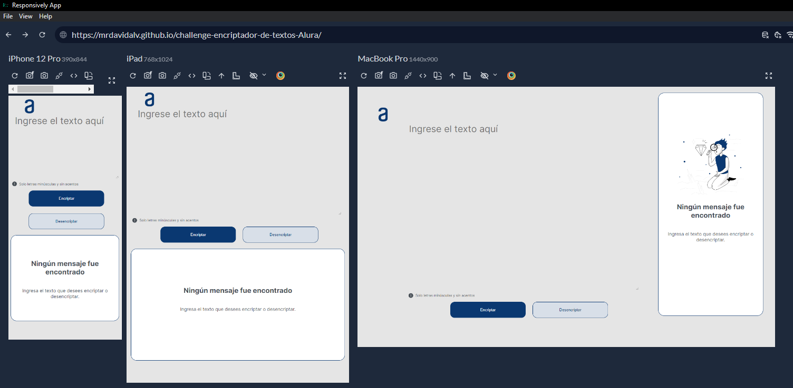

# ¡Bienvenidas y bienvenidos a nuestro primer desafío!

Durante estas cuatro semanas, vamos a trabajar en una aplicación que encripta textos, así podrás intercambiar mensajes secretos con otras personas que sepan el secreto de la encriptación utilizada.

### Puedes ver este proyecto [aquí](https://mrdavidalv.github.io/challenge-encriptador-de-textos-Alura/)

	

## Llaves de Encriptación

Las "llaves" de encriptación que utilizaremos son las siguientes:

- La letra "e" es convertida para "enter"
- La letra "i" es convertida para "imes"
- La letra "a" es convertida para "ai"
- La letra "o" es convertida para "ober"
- La letra "u" es convertida para "ufat"

## Requisitos

- Debe funcionar solo con letras minúsculas.
- No deben ser utilizados letras con acentos ni caracteres especiales.
- Debe ser posible convertir una palabra para la versión encriptada y también devolver una palabra encriptada para su versión original.

### Ejemplos

- "gato" => "gaitober"
- "gaitober" => "gato"

## Funcionalidades de la Página

La página debe tener campos para:

1. Inserción del texto que será encriptado o desencriptado, y el usuario debe poder escoger entre las dos opciones.
2. Mostrar el resultado en la pantalla.

### Extras

- Un botón que copie el texto encriptado/desencriptado para la sección de transferencia, o sea que tenga la misma funcionalidad del Ctrl+C o de la opción "copiar" del menú de las aplicaciones.

## Metodología de Trabajo

Tenemos un periodo de tiempo de cuatro semanas para desarrollar el proyecto y vamos a trabajar con el sistema ágil de desarrollo, utilizando el Trello de la siguiente forma:

- La columna **Listos para iniciar** presenta las tarjetas con elementos que aún no fueron desarrollados.
- En la columna **En Desarrollo** estarán los elementos que estés desarrollando en el momento. Al iniciar una tarea, podrás mover la tarjeta que contiene dicha tarea para esta columna.
- En la columna **Pausado** estarán los elementos que comenzaste a desarrollar, pero necesitaste parar por algún motivo.
- Por fin, en la columna **Concluido** estarán los elementos ya concluidos.

El Trello es una herramienta de uso individual para que puedas controlar el progreso de tus actividades, pero no será evaluada.
